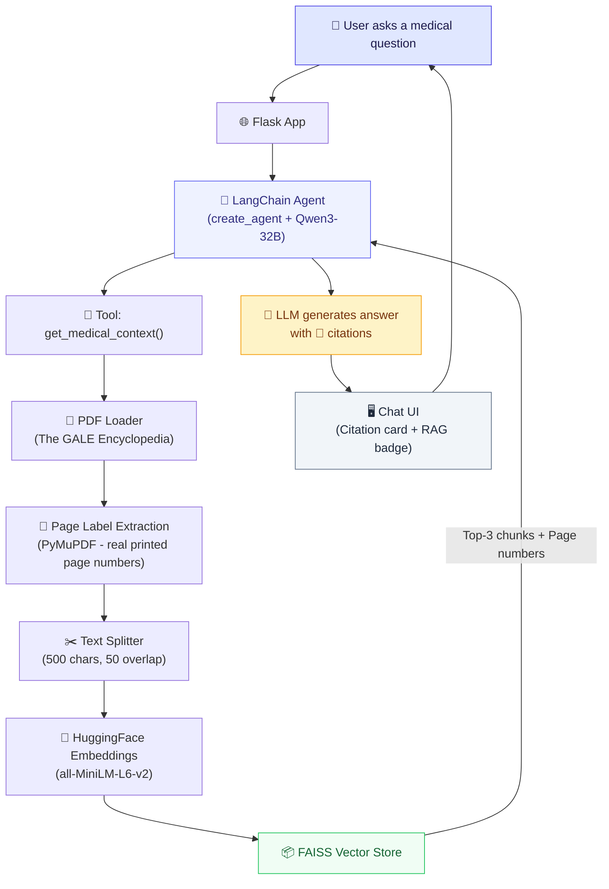

# 🏥 MedAssist AI — Medical RAG Chatbot

An AI-powered medical question-answering chatbot built with **LangChain Agents**, **RAG (Retrieval-Augmented Generation)**, and **Flask**. The agent retrieves verified medical information from *The GALE Encyclopedia of Medicine, 2nd Edition* and provides cited, trustworthy answers.

## 🔄 Workflow




## ✨ Features

- **RAG-Powered Answers** — Retrieves relevant context from a FAISS vector store built on a medical encyclopedia
- **Accurate Page Citations** — Uses PyMuPDF to extract real printed page numbers from the PDF (handles Roman numeral front matter and Arabic content pages), so citations match the physical book exactly
- **RAG Faithfulness** — Strict system prompt ensures the LLM only answers from retrieved context, never hallucinating from training knowledge. If the context doesn't cover the topic, it says so honestly
- **Modern LangChain Agent** — Uses the latest `create_agent` + `init_chat_model` API pattern
- **Conversational Memory** — Maintains chat history within a session using `InMemorySaver`
- **Clean UI** — Modern, responsive chat interface with styled citation cards and suggestion chips
- **CI/CD Pipeline** — Jenkins pipeline with Trivy security scanning and GCP Cloud Run deployment
- **Dockerized** — Production-ready Docker image using `uv` for fast dependency management

## 🛠️ Tech Stack

| Layer | Technology |
|---|---|
| **LLM** | Qwen3-32B via Groq API |
| **Agent Framework** | LangChain `create_agent` + LangGraph |
| **Embeddings** | HuggingFace `all-MiniLM-L6-v2` |
| **Vector Store** | FAISS (local) |
| **PDF Processing** | PyMuPDF (fitz) — real page label extraction |
| **Backend** | Flask |
| **Frontend** | Pure HTML/CSS/JS |
| **Package Manager** | uv |
| **Containerization** | Docker |
| **CI/CD** | Jenkins (Docker-in-Docker) |
| **Cloud** | GCP (Artifact Registry + Cloud Run) |
| **Security Scan** | Trivy |

## 📁 Project Structure

```
medical-rag-ai-agent/
├── app/
│   ├── application.py              # Flask app entry point
│   ├── components/
│   │   ├── agent.py                # LangChain agent with RAG tool & citations
│   │   ├── embeddings.py           # HuggingFace embedding model setup
│   │   ├── vector_store.py         # FAISS vector store load/save
│   │   ├── pdf_loader.py           # PDF ingestion, real page label extraction (PyMuPDF) & text chunking
│   │   └── data_loader.py          # Pipeline: PDF → chunks → vector store
│   ├── common/
│   │   ├── logger.py               # Logging configuration
│   │   └── custom_exception.py     # Custom exception handler
│   ├── config/
│   │   └── config.py               # App configuration & env variables
│   └── templates/
│       └── index.html              # Chat UI template
├── data/
│   └── The_GALE_ENCYCLOPEDIA_of_MEDICINE_SECOND.pdf
├── vectorstore/
│   └── db_faiss/                   # Pre-built FAISS index
├── custom_jenkins/
│   └── Dockerfile                  # Jenkins Docker-in-Docker image
├── Dockerfile                      # App Docker image (uv-based)
├── .dockerignore
├── Jenkinsfile                     # CI/CD pipeline (GCP)
├── pyproject.toml                  # Python dependencies
├── uv.lock                         # Locked dependencies
└── .python-version                 # Python 3.12
```

## 🚀 Getting Started

### Prerequisites

- Python 3.12+
- [uv](https://docs.astral.sh/uv/) package manager
- API keys for **Groq** and **HuggingFace**

### 1. Clone the Repository

```bash
git clone https://github.com/farhanrhine/medical-rag-ai-agent-gcp.git
cd medical-rag-ai-agent-gcp
```

### 2. Set Up Environment Variables

Create a `.env` file in the root directory:

```env
GROQ_API_KEY=your_groq_api_key
HUGGINGFACEHUB_API_TOKEN=your_huggingface_token
GROQ_QWEN_MODEL=qwen/qwen3-32b
```

### 3. Install Dependencies

```bash
uv sync
```

### 4. Build the Vector Store (First Time Only)

If the `vectorstore/db_faiss/` directory is empty, generate it:

```bash
uv run python -m app.components.data_loader
```

### 5. Run the Application

```bash
uv run python -m app.application
```

Open **<http://127.0.0.1:5000>** in your browser.

## 🐳 Docker

### Build & Run Locally

```bash
docker build -t medical-rag-ai-agent .
docker run -p 5000:5000 --env-file .env medical-rag-ai-agent
```

## ☁️ GCP Deployment

The project is configured for deployment to **Google Cloud Platform** using:

- **Artifact Registry** — Docker image storage
- **Cloud Run** — Serverless container hosting

### CI/CD Pipeline (Jenkins)

The `Jenkinsfile` automates the full deployment:

```
Clone Repo → Build Image → Trivy Scan → Push to Artifact Registry → Deploy to Cloud Run
```

### Manual Deployment (gcloud CLI)

```bash
# Authenticate
gcloud auth login
gcloud config set project YOUR_PROJECT_ID

# Build & push
docker build -t medical-rag-ai-agent .
docker tag medical-rag-ai-agent us-central1-docker.pkg.dev/YOUR_PROJECT_ID/medical-rag-ai-agent/medical-rag-ai-agent:latest
gcloud auth configure-docker us-central1-docker.pkg.dev --quiet
docker push us-central1-docker.pkg.dev/YOUR_PROJECT_ID/medical-rag-ai-agent/medical-rag-ai-agent:latest

# Deploy to Cloud Run
gcloud run deploy medical-rag-ai-agent \
    --image us-central1-docker.pkg.dev/YOUR_PROJECT_ID/medical-rag-ai-agent/medical-rag-ai-agent:latest \
    --region us-central1 \
    --port 5000 \
    --allow-unauthenticated
```

## 📖 How Page Citations Work

Unlike most RAG systems that use raw PDF page indices (which don't match printed page numbers), this project:

1. **Extracts real page labels** using PyMuPDF (`fitz`) — reads the actual printed page numbers from each page's footer text
2. **Handles front matter** — Roman numeral pages (ix, xi, xiii...) are correctly identified
3. **Handles content pages** — Arabic numbers (625, 626...) match the physical book exactly
4. **Stores labels in metadata** — Each text chunk carries the correct printed page number in the FAISS vector store
5. **Enforces faithfulness** — The LLM is instructed to only cite pages whose content directly answers the question

This means when the app says "Page 750", you can flip to page 750 in the book and verify the answer word-for-word.

## 🏗️ Architecture

See the [Workflow diagrams](#-workflow) at the top of this README for the full application and CI/CD flow.


## 👤 Author

**Farhan** — [GitHub](https://github.com/farhanrhine)
